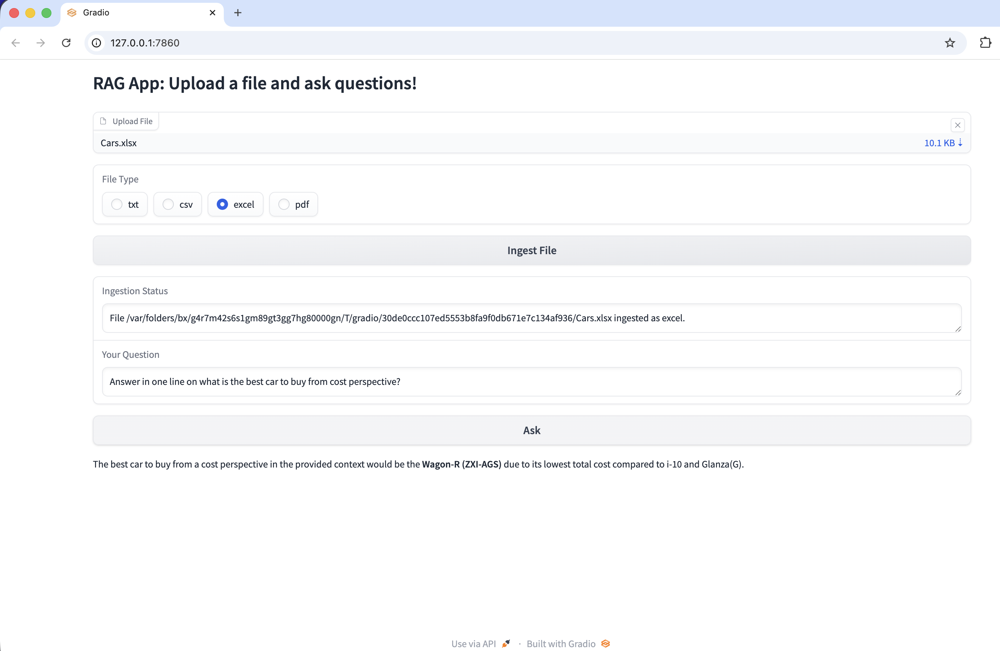

# RAG using OpenAI models & FAISS
This repository demonstrates a Retrieval-Augmented Generation (RAG) system using OpenAI models for text generation and FAISS for efficient similarity search over a vector database.
The app accepts training data in txt / CSV / excel / pdf formats.

## RAG Architecture

## install dependencies : 
pip install -r requirements.txt

## To run the Gradio UI, use: 
python main.py

## Working application screenshot
